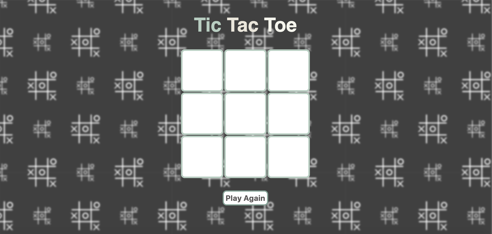

<h1>PROJECT TITLE</h1>

Tic Tac Toe 

<h2>HOW TO PLAY</h2>

<bold>1.</bold> Draw the board X or O.

2. Each player takes turn.

3. Winning the game by getting a row of three symbols. 

4. It is a draw if no one can win. 

<h2>IMAGE</h2>

<h2>GETTING STARTED</h2>

This is my first project. It was hard to begin with since I just started learning how to code two weeks ago. Writing down pseudo code helped me to break the process down into pieces, and allowed me to solve problems logically.  

<h2>STEPS</h2>

1. Created variables for winning combos.

2. Generated a for loop to go through each winning combo.

3. Added event listeners for every winning combo.

4. Set up a conditional statement that not allow overwriting in the same boxes and stop writing in any boxes after completing the game.

5. Started an if statement to check who is the winner.

6. Made an if statement to check for draw.

7. Established the draw function.

8. Created winning message. 

9. Generated draw message.

10. Added restart button.

11. Set up clearboard function to start new game automatically.

<h2>TECHNOLOGIES USED</h2>

HTML

CSS

Javascript 

<h2>PROJECT LINK<h2>

https://tg0606.github.io/tic-tac-toe/

